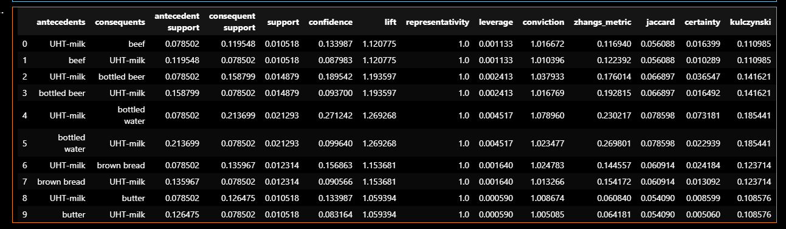
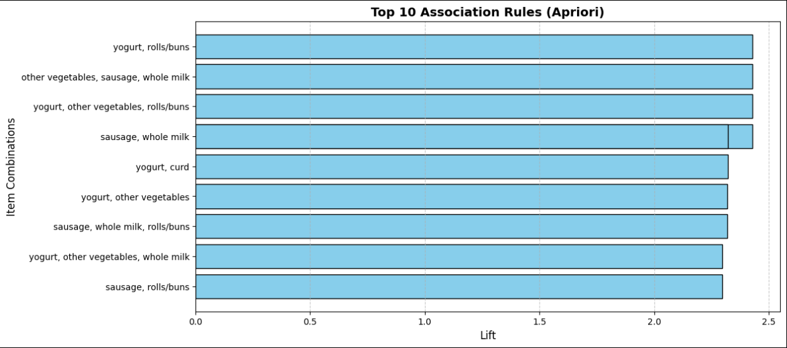

# 🛒 Market Basket Analysis

This project applies Association Rule Mining techniques on retail transaction data using **Apriori** and **FP-Growth** algorithms.

---

## 🔍 Objective
To identify frequent itemsets and generate strong association rules to make product bundling and marketing decisions.

---

## 📁 Files
| File | Description |
|------|-------------|
| `market_basket_analysis.ipynb` | Main notebook with EDA and association rule mining |
| `dataset.csv` | Transactional dataset |
| `requirements.txt` | Python package dependencies |

---

## 📊 Algorithms Used
- Apriori (from `mlxtend`)
- FP-Growth
- Visualization of support, confidence, and lift metrics

---

## 🔧 Tools & Libraries
- Python
- Pandas
- MLxtend
- Matplotlib / Seaborn

---

## 📸 Screenshots

### 🔹 Frequent Itemsets Output

### 🔹 Association Rules (Support vs Confidence)

---

## 👨‍💻 Developed By
**Vignesh S**  
Final Year CSE | Data Analytics Enthusiast  
[GitHub](https://github.com/Vigneshsaravanan12) | [LinkedIn](https://www.linkedin.com/in/vignesh-s-14273a334)

